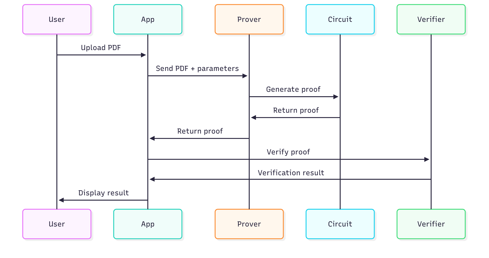

# Architecture

ZKPDF enables zero-knowledge verification of PDF documents through cryptographic proofs. The system consists of three main components: PDF processing utilities, zero-knowledge circuits, and a web application.

## System Overview

The verification process:

1. PDF document is parsed to extract text and validate digital signatures
2. Verification claims are processed through SP1 zero-knowledge circuits
3. Cryptographic proofs are generated without revealing document content
4. Proofs can be verified on-chain or off-chain

## Core Components

### PDF Utils (`pdf-utils/`)

Rust-based PDF processing library designed for zero-knowledge environments. Provides text extraction, signature validation, and unified verification interface with WebAssembly support for browser compatibility.

### Circuits (`circuits/`)

SP1-compatible zero-knowledge circuits containing the main verification library, SP1 program implementation, and proving infrastructure utilities.

### App (`app/`)

Next.js frontend application providing PDF upload, real-time verification, proof generation, and integration with the prover server and WASM modules.

## Data Flow

### PDF Processing

1. Document upload through web interface
2. Client-side parsing using WebAssembly
3. Text and signature extraction
4. Initial validation

### Proof Generation

1. PDF data prepared for SP1 circuits
2. SP1 zkVM executes verification program
3. Zero-knowledge proof generated
4. Public values committed to proof

### Verification

1. Proof validated locally or on-chain
2. Results displayed without revealing document content

## PDF Support

| Feature                                    | Support |
| ------------------------------------------ | ------- |
| Text extraction                            | ✅      |
| RSA-SHA256 signatures                      | ✅      |
| Multi-page documents                       | ✅      |
| Common font encodings and CID fonts        | ✅      |
| Standard PDF structures and compression    | ✅      |
| Image extraction                           | ❌      |
| Form fields                                | ❌      |
| ECDSA signatures                           | ❌      |
| Complex layouts and advanced font features | ❌      |

## Performance Characteristics

- Large PDFs require significant memory (8-16GB)
- Proof generation: 20-3 mins depending on mode
- Browser memory limitations for file processing
