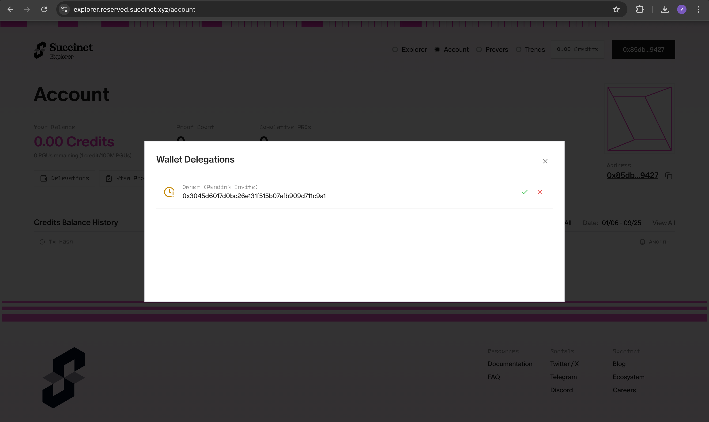

# Proving

This section covers how to generate zero-knowledge proofs from ZKPDF circuits using different approaches.

## Using the Succinct Prover Network

While local proof generation works well for development and testing, we've partnered with **Succinct Labs** to provide access to their powerful Prover Network for hackathons and production applications.

### Why Use the Prover Network?

- **Eliminates Server Limitations**: No need to run heavy proving computations locally
- **Faster Proof Generation**: Distributed proving infrastructure for better performance
- **Cost Effective**: Pay-per-use model for proof generation
- **Scalable**: Handle multiple proofs simultaneously
- **Production Ready**: Enterprise-grade proving infrastructure

### Getting Access

1. **Generate a Public Key**: Create a new public key for prover network access
2. **Fill the Access Form**: Submit your details at [https://forms.gle/aqVoYupq3cjNYtCf8](https://forms.gle/aqVoYupq3cjNYtCf8)
3. **Get Added to Delegation**: We'll add your public key to the delegation list
4. **Access the Explorer**: Login to [https://explorer.reserved.succinct.xyz/](https://explorer.reserved.succinct.xyz/)



5. **Approve Access**: Click the approve button to activate your prover network access

### Configuration

#### Option 1: Environment Variables

```bash
# Set prover network environment
export SP1_PROVER=network
export NETWORK_PRIVATE_KEY=your_private_key_here

# Generate proofs using the network
cargo run --release --bin evm -- --system groth16
```

#### Option 2: .env File (Recommended)

Create a `.env` file in your project root:

```bash
# Copy the example environment file
cp .env.example .env
```

Then edit `.env` with your credentials:

```env
SP1_PROVER=network
NETWORK_PRIVATE_KEY=your_private_key_here
```

The `.env` file will be automatically loaded when you run the scripts.

### Using the Prover Network

Once configured, you can generate proofs using the distributed network:

```bash
# Generate Groth16 proof using the network
cargo run --release --bin evm -- --system groth16

# Generate PLONK proof using the network
cargo run --release --bin evm -- --system plonk

# Use custom PDF with the network
cargo run --release --bin evm -- --system groth16 --pdf-path /path/to/your/certificate.pdf
```

### Benefits for Hackathons

The Succinct Prover Network is particularly valuable for hackathons because:

- **No Setup Required**: Skip complex proving infrastructure setup
- **Fast Iteration**: Quick proof generation for rapid prototyping
- **Cost Effective**: Pay only for what you use
- **Reliable**: Enterprise-grade uptime and performance
- **Scalable**: Handle multiple team members simultaneously

## Benchmarks

Performance metrics for zkPDF proof generation using the Succinct Prover Network:

| Metric               | PDF #1                                                | PDF #2 (PAN Card from DigiLocker)                     |
| -------------------- | ----------------------------------------------------- | ----------------------------------------------------- |
| PDF Size             | 268.0 KiB                                             | 104.0 KiB                                             |
| SP1 Network Link     | [View Proof](https://explorer.reserved.succinct.xyz/) | [View Proof](https://explorer.reserved.succinct.xyz/) |
| Document Type        | Signed PDF                                            | PAN Card from DigiLocker                              |
| Signature Algorithm  | RSA with SHA1                                         | RSA with SHA256                                       |
| SP1 Version          | sp1-v5.0.0                                            | sp1-v5.0.0                                            |
| Proof Time (Groth16) | 52 seconds                                            | 31 seconds                                            |
| Cycle Count          | 44,052,327 cycles                                     | 29,940,291 cycles                                     |
| Gas Used             | 50,575,525                                            | 35,255,053                                            |

### Performance Notes

- **Proof Time**: Groth16 proofs typically take 30-60 seconds depending on document complexity
- **Cycle Count**: Higher cycle counts indicate more complex PDF processing
- **Gas Usage**: On-chain verification costs scale with proof complexity
- **Document Size**: Larger PDFs generally require more processing time

### Troubleshooting

#### Access Issues

If you're having trouble accessing the prover network:

1. **Verify Form Submission**: Ensure you've submitted the access form
2. **Check Delegation**: Confirm your public key has been added to the delegation list
3. **Explorer Access**: Make sure you can login to the explorer and see your delegation
4. **Contact Support**: Ping @vikasrushi on Telegram for immediate assistance

#### Configuration Issues

```bash
# Verify your environment variables
echo $SP1_PROVER
echo $NETWORK_PRIVATE_KEY

# Check .env file exists and has correct format
cat .env
```

**Note**: For immediate access to the Prover Network, please ping @vikasrushi on Telegram after submitting the form.
